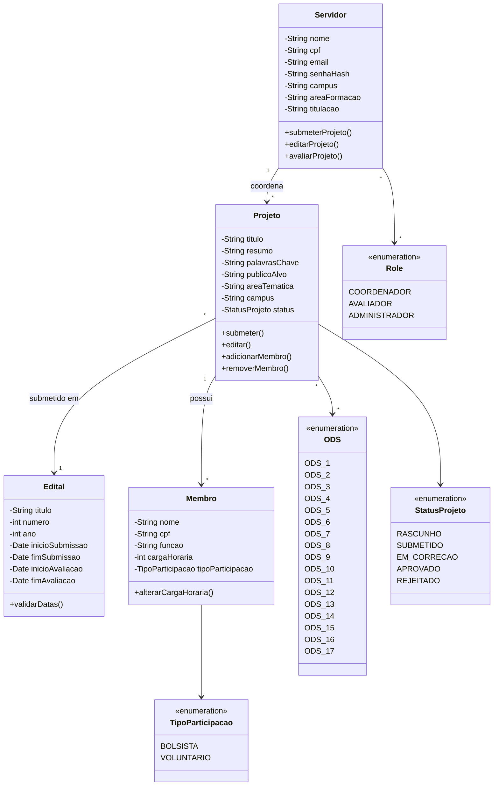

# gct-20261
Repositório da turma de GC&amp;T 2026.1 

# Diagrama de Classes

```mermaid
classDiagram

class Servidor {
    -String nome
    -String cpf
    -String email
    -String senhaHash
    -String campus
    -String areaFormacao
    -String titulacao

    +submeterProjeto()
    +editarProjeto()
    +avaliarProjeto()
}

class Projeto {
    -String titulo
    -String resumo
    -String palavrasChave
    -String publicoAlvo
    -String areaTematica
    -String campus
    -StatusProjeto status

    +submeter()
    +editar()
    +adicionarMembro()
    +removerMembro()
}

class Edital {
    -String titulo
    -int numero
    -int ano
    -Date inicioSubmissao
    -Date fimSubmissao
    -Date inicioAvaliacao
    -Date fimAvaliacao

    +validarDatas()
}

class Membro {
    -String nome
    -String cpf
    -String funcao
    -int cargaHoraria
    -TipoParticipacao tipoParticipacao

    +alterarCargaHoraria()
}

class Role {
    <<enumeration>>
    COORDENADOR
    AVALIADOR
    ADMINISTRADOR
}

class ODS {
    <<enumeration>>
    ODS_1
    ODS_2
    ODS_3
    ODS_4
    ODS_5
    ODS_6
    ODS_7
    ODS_8
    ODS_9
    ODS_10
    ODS_11
    ODS_12
    ODS_13
    ODS_14
    ODS_15
    ODS_16
    ODS_17
}

class TipoParticipacao {
    <<enumeration>>
    BOLSISTA
    VOLUNTARIO
}

class StatusProjeto {
    <<enumeration>>
    RASCUNHO
    SUBMETIDO
    EM_CORRECAO
    APROVADO
    REJEITADO
}

Servidor "1" --> "*" Projeto : coordena
Projeto "*" --> "1" Edital : submetido em
Projeto "1" --> "*" Membro : possui

Servidor "*" --> "*" Role
Projeto "*" --> "*" ODS

Membro --> TipoParticipacao
Projeto --> StatusProjeto
```